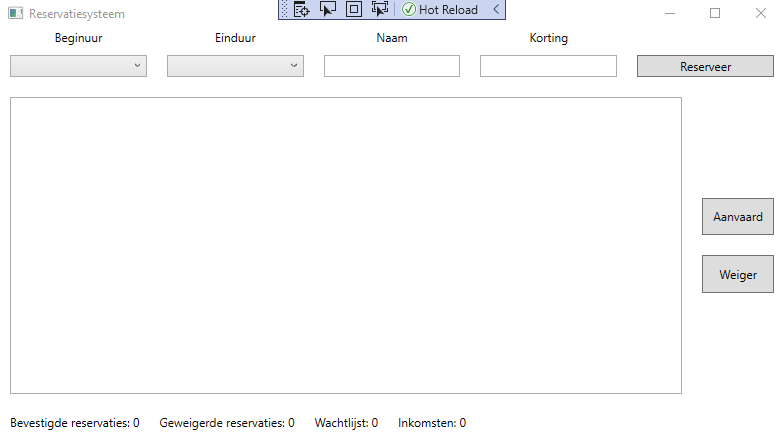
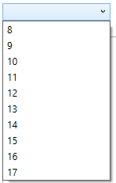
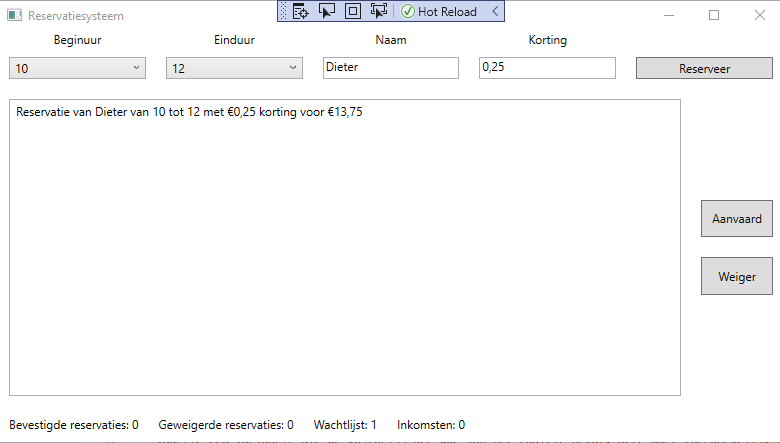
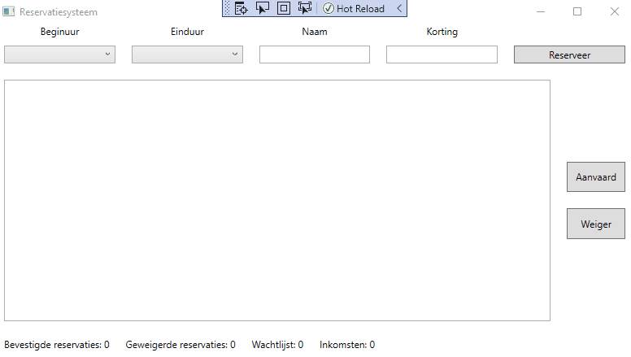

# PE01: Reservatiesysteem

Voor deze opdracht zul je een kleine applicatie moeten schrijven die gebruikt kan worden om een zaaltje te reserveren waarvoor 7 euro per uur betaald moet worden. We zullen jullie stap per stap vertellen hoe je dit kunt programmeren.

## Stap 1: Maak de WPF-layout



Het bovenste deel wordt gebruikt om de zaal te reserveren. Daarvoor moet de gebruiker een begin en einduur selecteren uit 2 comboboxen. De mogelijkheden die in de combobox moeten komen, zie je hieronder. 



Daarnaast is er nog een tekstvak waar de gebruiker zijn naam kan intypen en een tekstvak waarin de gebruiker een bedrag kan ingeven dat als korting gebruikt kan worden. Als laatste is er nog een knop die de reservatie bevestigt.

Eens de bevestiging gebeurd is, komt de reservatie terecht in de listbox onderaan.



Als Dieter een reservatie doet voor het zaaltje van 10 tot 12 uur en hij vraagt om €0,25 korting, moet hij in totaal dus €13.75 betalen. Aangezien we niet willen dat iedereen zomaar reservaties kan doen en hun eigen korting kiezen, zijn er ook nog twee knoppen voorzien die bedoeld zijn voor de beheerder van het zaaltje.

Deze kan kiezen om een reservatie te aanvaarden of te weigeren.

Helemaal onderaan staan er dan nog enkele labels die wat statistieken bevatten:

- Bevestigde reservaties: het aantal keer dat op de aanvaard knop geklikt is
- Geweigerde reservaties: het aantal keer dat op de weiger knop geklikt is
- Wachtlijst: Het aantal items dat nog wacht op aanvaarding/weigering
- Inkomsten: Hoeveel de verhuur van het zaaltje opgebracht heeft.

Hieronder zie je een uitgebreide demo van de code.

## Stap 2: De code-behind

Eens de WPF-layout klaar is, voer je best volgende stappen uit:

- Zorg dat de comboboxen de juiste waarden bevatten.
- Voorzie een variabele die de kostprijs per uur van het zaaltje bevat. Deze moet toegankelijk zijn voor iedere methode in de code-behind
- Voorzie een methode die de totaalprijs berekent gegeven een begin en einduur en een korting
- Koppel een click handler aan de `Reserveer` knop die de juiste zin toevoegt aan de listbox
- Voorzie variabelen voor de verschillende statistieken die toegankelijk zijn in alle methoden
- Zorg dat de `Aanvaard` en `Weiger` knop de statistieken correct updaten

    - Om het inkomsten label correct up te daten zal het nodig zijn om de totaalprijs van het geselecteerde item uit de listbox te bepalen. Hoe je dit kan doen, vind je onderaan bij tips.
- Zorg er voor dat als een reservatie aanvaard of geweigerd is, deze uit de listbox verdwijnt.

## Tips

We hebben voor jullie al een methode voorzien die je kan gebruiken om de prijs van het geselecteerde item uit de listbox te bepalen. Deze ziet er zo uit.

```csharp
private decimal SeperatePrice(string selectedString)
{
    return decimal.Parse(selectedString.Split(" ").Last().Substring(1));
}
```

Het is niet de bedoeling dat je snapt wat deze methode doet. Het enige wat je moet weten is dat je er een string aan kunt meegeven. Deze string moet het formaat van de strings uit de listbox hebben. Dus iets van de vorm

```
Reservatie van Dieter van 10 tot 12 met €0,25 korting voor €13,75
```

Deze methode geeft een decimal terug die de totaalprijs bevat. Als je dus bovenstaande string als parameter meegeeft, krijg je de decimal `13,75` terug.


